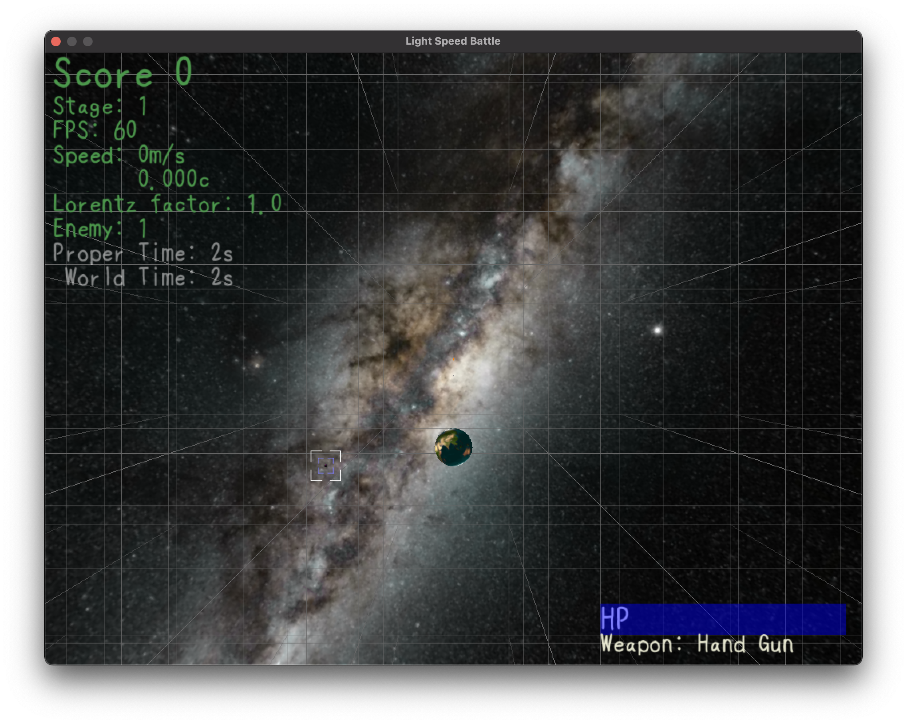
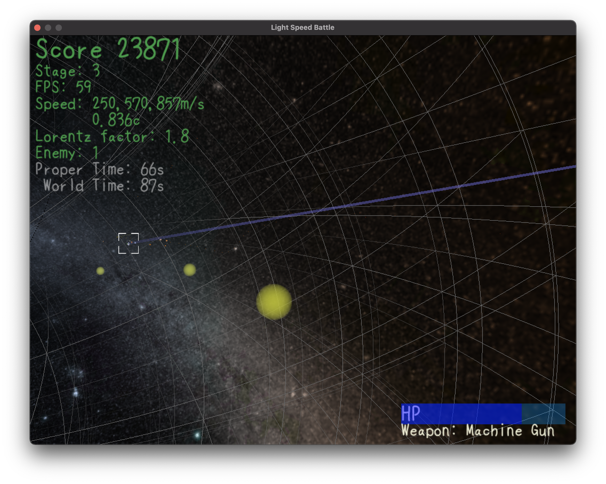

# Light Speed Battle

特殊相対性理論の効果を取り入れたFPSゲーム。




## 動かし方

依存

* Python3
* OpenGL
* SDL2

環境構築

1. Python3 をインストール
2. OpenGL をインストール
    * macOS なら `brew install glfw` など
3. このレポジトリに同梱されている SDL2 で動かなかった場合、 SDL2 を自前でインストールする
    * macOS なら `brew install sdl2`
4. Python ライブラリのインストール

    ```
    pip install pipenv
    pipenv install -d
    ```
5. Cython のビルド

    ```
    python cython_setup.py build_ext --inplace
    ```
6. プレイ

    ```
    pipenv run python LSBattle3D.py
    ```
